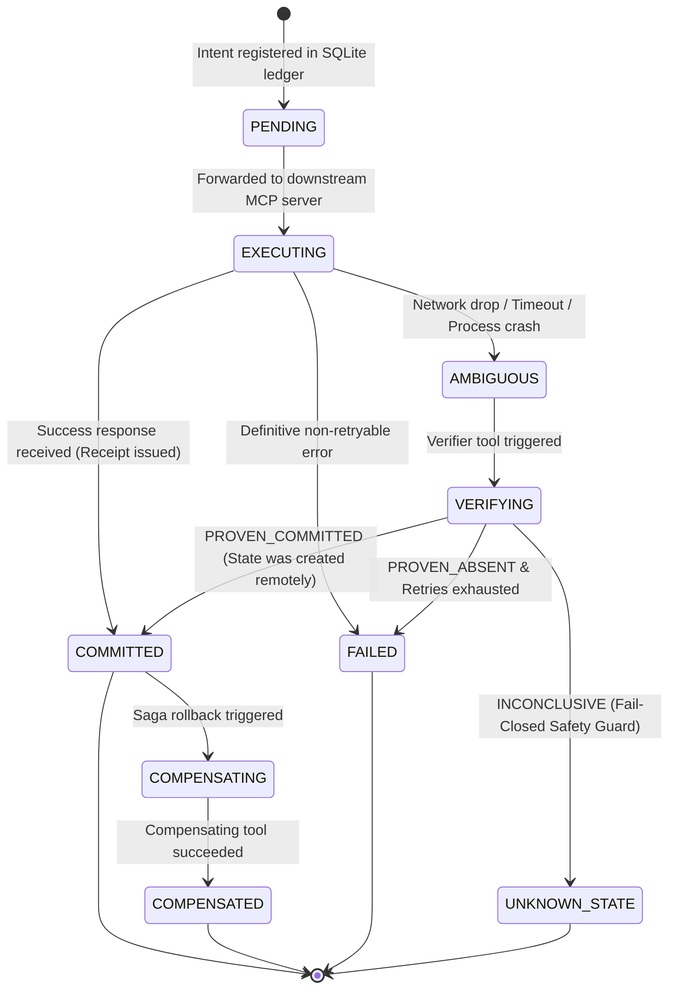

# AgentX

**Transactional reliability for MCP tool calls: preview, execute once, verify, and compensate AI agent actions.**

[](https://github.com/studivox/agentx/actions/workflows/ci.yml)
[](LICENSE)
[](https://nodejs.org)
[](https://www.typescriptlang.org/)
[](https://modelcontextprotocol.io)

---

## 1. The Core Invariant

### 1.1. The Problem
When an AI agent executes real-world actions through the **Model Context Protocol (MCP)**—such as booking appointments, creating GitHub pull requests, dispatching payments, or sending customer emails—standard RPC transport failures create ambiguity:

> **An MCP action may succeed in the downstream system while its network response is dropped, timed out, or interrupted by a client crash. A blind retry will execute the mutating action a second time.**

```
[ Agent LLM ] ──( tools/call )──► [ Network Timeout / Drop ] ──( Blind Retry )──► [ Duplicate Side Effect! ]
                                         │
                                         ▼
                             (Action succeeded remotely,
                              but response was lost)
```

### 1.2. The Solution
**AgentX** is a local-first, zero-cloud-dependency transactional reliability layer and proxy that sits transparently between any MCP host (Claude Desktop, Cursor, Antigravity CLI, custom LLM orchestrators) and downstream MCP tool servers.

AgentX delivers:
* **Deterministic Logical Identity:** Canonical JSON argument sorting and declared logical key extraction (`SHA-256`) to deduplicate retries regardless of argument formatting.
* **Durable SQLite WAL Ledger:** Atomic local state tracking (`PENDING` → `EXECUTING` → `COMMITTED` / `AMBIGUOUS` / `UNKNOWN_STATE`).
* **Active Postcondition Verification:** Automatic interrogation of external system state via verifier tools before making retry decisions.
* **Replay Protection:** Immediate cached receipt returns for duplicate requests with zero downstream invocations.
* **Saga Compensation Coordinator:** Declarative rollback mechanisms for individual and multi-step composite operations in reverse (LIFO) order.
* **Cryptographic & Redacted Receipts:** Auditable JSON receipts with automatic recursive masking of secrets, API keys, and sensitive fields.

### 1.3. Verified Proof
Every capability in AgentX is backed by reproducible automated suites and live integration benchmarks:
* **8 test suites with 35 passing tests** covering canonicalization, ledger WAL transactions, verifier reconciliations, saga rollbacks, sensitive data scrubbing, proxy interception, and CLI operations.
* **< 1.5 ms** local SQLite transaction overhead.
* **Fail-closed guarantees** preventing duplicate mutations on unverified critical actions.

### 1.4. Quick Start (Currently Verified via Source)
```bash
# 1. Clone the repository
git clone https://github.com/studivox/agentx.git
cd agentx

# 2. Install dependencies & build
npm ci
npm run build

# 3. Verify tests and demo
npm test
npm run demo

# 4. Run the AgentX system doctor
node dist/cli.js doctor --manifest examples/agentx.config.json
```

---

## 2. "Without AgentX" vs. "With AgentX"

| Failure Scenario | Without AgentX (Raw MCP / Blind Retry) | With AgentX |
| :--- | :--- | :--- |
| **Network Timeout during Payment / Booking** | Agent assumes failure, retries action, causing **double charge or duplicate booking**. | Intercepts timeout, executes declared **postcondition verifier**, proves remote commitment, and returns cached receipt. |
| **Agent Re-invokes Same Tool with Reordered JSON** | Argument ordering difference causes cache miss; downstream server executes duplicate mutation. | Deterministic **canonical sorting and logical key hashing** matches existing record, returning `idempotentReplay: true` with **0 downstream calls**. |
| **Flaky Unverified Destructive Mutation** | Blind retry risks catastrophic repeated destructive write or corrupt state. | **Fail-Closed Safety**: Locks transaction into `UNKNOWN_STATE`, blocks blind retries, and emits actionable alert. |
| **Failure in Multi-Step Workflow (Step 3 of 4 fails)** | Previous steps 1 and 2 remain orphaned and half-committed in downstream systems. | **Saga Coordinator** triggers registered compensators in reverse (LIFO) order to cleanly roll back prior steps. |
| **Credential / PII Logging in Audits** | Raw passwords, credit card numbers, or API keys are written to debug logs or disk. | Automatic **recursive parameter scrubbing** redacts sensitive keys matching policy rules before writing to ledger or receipt. |

---

## 3. Architecture & System Overview

```mermaid
flowchart TD
    subgraph Host["MCP Client / Agent Host"]
        Client["Claude Desktop / Cursor / Custom Agent"]
    end

    subgraph AgentX["AgentX Transactional Reliability Layer"]
        Proxy["Stdio / Transport Interceptor"]
        FP["Deterministic Canonical Fingerprinter\n(SHA-256)"]
        Ledger[("Durable SQLite Ledger\n(WAL Mode)")]
        Verifier["Active Postcondition\nVerifier Engine"]
        Saga["Saga Compensation\nCoordinator"]
        Redact["Recursive Secret\n& PII Redactor"]
    end

    subgraph Downstream["Downstream MCP Servers"]
        Tools["Target MCP Server\n(Databases, APIs, Payments, Git)"]
    end

    Client -->|1. tools/call (stdio)| Proxy
    Proxy -->|2. Hash Logical Keys| FP
    FP -->|3. Check Existing Tx| Ledger
    Ledger -->|4. If Committed, Return Cached Receipt| Proxy
    Proxy -->|5. Record PENDING -> EXECUTING| Ledger
    Proxy -->|6. Forward Call| Tools
    Tools -.->|7a. Success| Proxy
    Tools -.->|7b. Timeout / Network Drop| Verifier
    Verifier -->|8. Query External State| Tools
    Verifier -->|9. Reconcile Outcome| Ledger
    Proxy -->|10. Sanitize & Redact| Redact
    Redact -->|11. Generate Receipt| Ledger
    Proxy -->|12. Return Result + Receipt| Client
```

---

## 4. Transaction State Machine Lifecycle



---

## 5. Five-Minute Integration Guide

### 5.1. Wrap an MCP Server via Local CLI
Wrap any existing MCP server command without modifying downstream code:

```bash
# Using the compiled local CLI binary
node dist/cli.js wrap --server "node" "/path/to/my-mcp-server.js" --manifest "agentx.config.json"

# Or using npm dev script
npm run dev -- wrap --server "node" "/path/to/my-mcp-server.js" --manifest "agentx.config.json"

# Or after running 'npm link' inside this repository
agentx wrap --server "node" "/path/to/my-mcp-server.js" --manifest "agentx.config.json"
```

### 5.2. Configure in Claude Desktop or Cursor
In your `claude_desktop_config.json` or `mcp_config.json`:

```json
{
  "mcpServers": {
    "booking-service": {
      "command": "node",
      "args": [
        "/path/to/agentx/dist/cli.js",
        "wrap",
        "--server",
        "node",
        "/path/to/booking-server.js",
        "--manifest",
        "/path/to/agentx.config.json"
      ]
    }
  }
}
```

### 5.3. Declare Tool Policy Manifest (`agentx.config.json`)
```json
{
  "version": "1.0.0",
  "serverName": "clinic-payment-service",
  "ledgerPath": ".agentx/agentx.db",
  "defaultPolicy": {
    "timeoutMs": 15000,
    "maxRetries": 2,
    "ttlSeconds": 604800
  },
  "tools": {
    "get_appointment": {
      "toolName": "get_appointment",
      "riskLevel": "READ_ONLY"
    },
    "book_appointment": {
      "toolName": "book_appointment",
      "riskLevel": "MUTATING_CRITICAL",
      "logicalKeys": ["patientId", "doctorId", "date", "slot"],
      "timeoutMs": 5000,
      "maxRetries": 2,
      "sensitiveFields": ["patientPhone", "medicalNote"],
      "verifier": {
        "toolName": "get_appointment",
        "argumentMapping": {
          "patientId": "patientId",
          "date": "date"
        },
        "matchKeyPath": "status",
        "expectedValue": "CONFIRMED"
      },
      "compensator": {
        "toolName": "cancel_appointment",
        "argumentMapping": {
          "appointmentId": "result.appointmentId"
        }
      }
    },
    "cancel_appointment": {
      "toolName": "cancel_appointment",
      "riskLevel": "MUTATING_SAFE",
      "logicalKeys": ["appointmentId"]
    }
  }
}
```

---

## 6. Live Interactive Demo Output

Running `npm run demo` executes the live test bed demonstrating all four core operational scenarios:

```text
============================================================
         AgentX Flagship Demonstration & Verification
============================================================

[AgentX] [INFO] Loaded AgentX manifest from examples/agentx.config.json
[Scenario 1] Executing First Mutating Request: book_appointment
  [Mock Server RPC] Executing tool: book_appointment (Call #1)
[AgentX] [INFO] Transaction tx_6f2846ab committed successfully.
  [+] Call 1 Completed.
  [+] Receipt ID: rcpt_87127ca2e828421ca5f6aa2babe53533
  [+] Transaction State: COMMITTED
  [+] Idempotent Replay: false
  [+] Sanitized Arguments stored in Ledger (PII Redacted):
      {"patientId":"patient_4081","doctorId":"doc_dr_ayse","date":"2026-09-01","slot":"14:30","patientPhone":"[REDACTED]","medicalNote":"[REDACTED]"}
  [+] Downstream Server RPC Invocations: 1

[Scenario 2] Agent attempts duplicate call with reordered arguments (Simulating blind retry)...
[AgentX] [INFO] Idempotent hit for book_appointment (Hash: 01c86a62c0...). Returning cached receipt.
  [✓] AgentX Intercepted Duplicate Call!
  [✓] Idempotent Replay Flag: true
  [✓] Server Call Count Delta: 0 (ZERO additional calls sent to downstream server!)
  [✓] Duplicate side-effect completely prevented.

[Scenario 3] Simulating Ambiguous Outcome (Timeout on booking, but state mutated in backend)...
  [Flaky Server RPC] Invoked: book_appointment
[AgentX] [WARN] Attempt 1 for tx_2432f6de failed with error: Connection reset by peer / ETIMEDOUT
[AgentX] [INFO] Starting postcondition verification for tx_2432f6de using verifier get_appointment
  [Flaky Server RPC] Invoked: get_appointment
[AgentX] [INFO] Postcondition verification completed: outcome=PROVEN_COMMITTED, state=COMMITTED
[AgentX] [INFO] Postcondition verification proved tx_2432f6de was already COMMITTED!
  [✓] AgentX Automatically Executed Postcondition Verifier: get_appointment
  [✓] Reconciled Final State: COMMITTED
  [✓] Verification Evidence:
      {"verifierArgs":{"patientId":"patient_9921","date":"2026-09-02"},"response":{"appointmentId":"appt_patient_9921_2026-09-02","status":"CONFIRMED"}}
  [✓] Ambiguity successfully resolved without duplicate execution!

[Scenario 4] Executing Saga Compensation for first appointment...
[AgentX] [INFO] Executing compensation for transaction tx_6f2846ab using tool cancel_appointment
  [Mock Server RPC] Executing tool: cancel_appointment (Call #4)
[AgentX] [INFO] Compensation finished: status=SUCCESS, finalState=COMPENSATED
  [✓] Compensation Status: SUCCESS
  [✓] Final Transaction State in Ledger: COMPENSATED
  [✓] Appointment Store Count: 2 (Appointment cancelled)

============================================================
        Demo Finished: All Transactional Invariants Verified!
============================================================
```

---

## 7. Cryptographic & Evidence-Backed Receipt Format

Every transactional mutation yields a cryptographically verifiable JSON receipt stored in the ledger:

```json
{
  "receiptId": "rcpt_ea07175f9a844ed9943ab1a57ce575a5",
  "transactionId": "tx_2432f6de1f904180afaecc2c4a2a9d8b",
  "fingerprint": "fc67aab5c3fb8a0a49cf0806b5ae4970aebe18dcb50c38d167045174756a705a",
  "toolName": "book_appointment",
  "state": "COMMITTED",
  "riskLevel": "MUTATING_CRITICAL",
  "idempotentReplay": false,
  "createdAt": "2026-08-24T18:46:36.507Z",
  "committedAt": "2026-08-24T18:46:36.512Z",
  "sanitizedArguments": {
    "patientId": "patient_9921",
    "doctorId": "doc_dr_mehmet",
    "date": "2026-09-02",
    "slot": "10:00"
  },
  "result": {
    "appointmentId": "appt_patient_9921_2026-09-02",
    "status": "CONFIRMED"
  },
  "attemptsCount": 1,
  "verificationEvidence": {
    "verifierArgs": {
      "patientId": "patient_9921",
      "date": "2026-09-02"
    },
    "response": {
      "appointmentId": "appt_patient_9921_2026-09-02",
      "status": "CONFIRMED"
    }
  }
}
```

---

## 8. CLI Reference

AgentX provides a complete CLI for operators and developers:

```bash
# 1. Start the transparent transactional proxy
node dist/cli.js wrap --server "node" "dist/server.js" --manifest "agentx.config.json"

# 2. List recent ledger transactions
node dist/cli.js list --state COMMITTED --limit 10

# Output as structured JSON
node dist/cli.js list --json

# 3. Inspect detailed attempt history and state transitions
node dist/cli.js status tx_2432f6de1f904180afaecc2c4a2a9d8b

# 4. Export verifiable receipt JSON
node dist/cli.js receipt tx_2432f6de1f904180afaecc2c4a2a9d8b

# 5. Run database health and configuration integrity doctor
node dist/cli.js doctor --manifest agentx.config.json
```

### Environment Variables

| Variable | Description | Default |
| :--- | :--- | :--- |
| `AGENTX_DB_PATH` | Path to durable SQLite ledger database | `.agentx/agentx.db` |
| `AGENTX_CONFIG` | Path to policy manifest configuration file | `agentx.config.json` |
| `AGENTX_LOG_LEVEL` | Diagnostic log level (`DEBUG`, `INFO`, `WARN`, `ERROR`, `SILENT`) | `INFO` |

---

## 9. Future npm Distribution (After npm Release)

> [!NOTE]
> The `@studivox/agentx` package is currently in pre-release and has **not yet been published to npm**. The commands below will be active upon public package registry release.

```bash
# Future global npx invocation (after npm publish)
npx @studivox/agentx wrap --server "node" "server.js" --manifest "agentx.config.json"

# Future installation in project dependencies
npm install @studivox/agentx
```

---

## 10. Comparison: Architectural Landscape

| Feature / Dimension | Raw MCP | Simple Retry Loop | Traditional HTTP Idempotency (Stripe/AWS) | Temporal / Cadence | Academic Cordon (2025/2026) | **AgentX** |
| :--- | :--- | :--- | :--- | :--- | :--- | :--- |
| **Zero Code Changes to Tools** | Yes | Yes | No (requires header rewrite) | No (heavy SDK rewrite) | No (custom sandbox) | **Yes (Transparent Proxy)** |
| **Local-First & Zero-Cloud** | Yes | Yes | No (Redis/DynamoDB) | No (Cluster backend) | Yes | **Yes (Local SQLite WAL)** |
| **Deterministic Logical Hashing**| No | No | Header-dependent | Workflow replay | State sandbox | **Yes (Canonical SHA-256)** |
| **Active Postcondition Verifier** | No | No | No | No | No | **Yes (State Reconciliation)** |
| **Saga-Style Reverse Rollback** | No | No | No | Custom code | Shadow state | **Yes (Declarative LIFO)** |
| **Automatic Secret Redaction** | No | No | Manual | Manual | No | **Yes (Recursive scrubbing)** |
| **Fail-Closed Safety Guard** | No | No | No | Retry loop | Staging abort | **Yes (`UNKNOWN_STATE` lock)** |

---

## 11. Honest Limitations & Boundaries

AgentX is engineered for practical and rigorous operational reliability, but it is not magic:
1. **Not Universal Distributed 2PC:** Third-party web APIs that lack query/verifier endpoints or idempotency keys cannot be made 100% atomic if they fail ambiguously. AgentX protects against duplicate execution by failing closed (`UNKNOWN_STATE`).
2. **Requires Verifier Declarations for Complex APIs:** To prove state after a dropped connection, an inspection tool (e.g., `get_payment_status`, `check_ticket`) should be declared in the manifest.
3. **Local-First Disk Requirement:** The SQLite WAL ledger requires access to local persistent storage.

---

## 12. Roadmap

- [x] **v1.0.0:** Deterministic fingerprinting, SQLite WAL ledger, active verifier engine, saga coordinator, stdio proxy, CLI, secret redactor.
- [ ] **v1.1.0:** Remote Streamable HTTP / SSE transport proxy support.
- [ ] **v1.2.0:** Auto-synthesizing verifier schemas directly from OpenAPI / MCP schema metadata.
- [ ] **v1.3.0:** Local web-based interactive visual ledger explorer.

---

## 13. Community & Contributing

We welcome contributions to expand the transactional reliability frontier for AI agents!

* **Contributing Guide:** See [CONTRIBUTING.md](CONTRIBUTING.md) for development setup and guidelines.
* **Security Disclosures:** See [SECURITY.md](SECURITY.md) for vulnerability reporting.
* **Code of Conduct:** See [CODE_OF_CONDUCT.md](CODE_OF_CONDUCT.md).
* **Changelog:** See [CHANGELOG.md](CHANGELOG.md).

---

## 14. License

[MIT License](LICENSE). Copyright (c) 2026 AgentX Core Maintainers.
