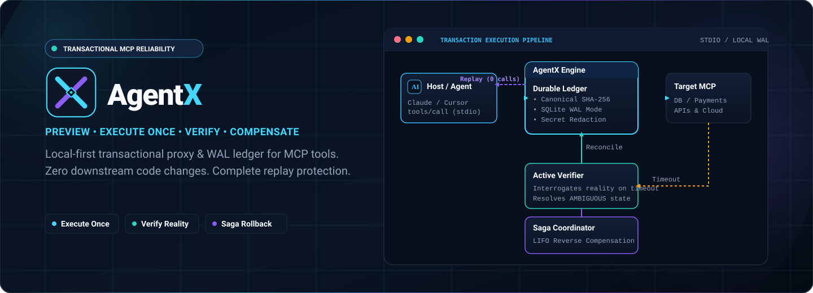
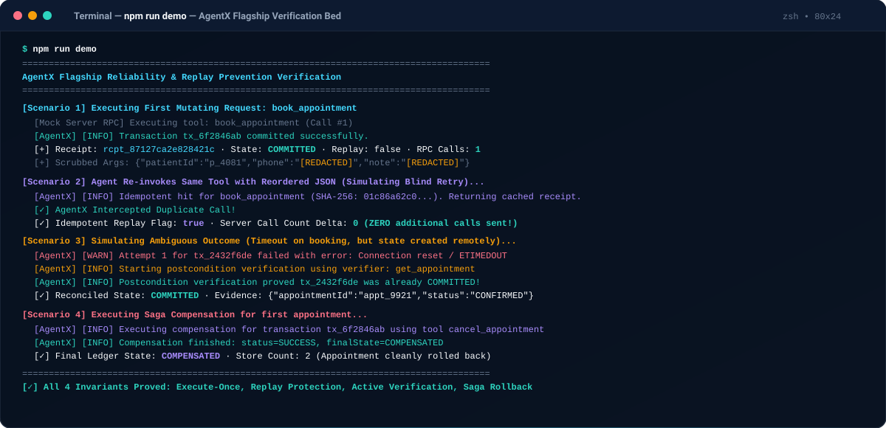
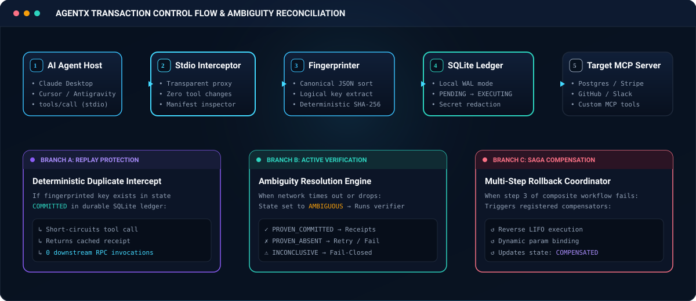
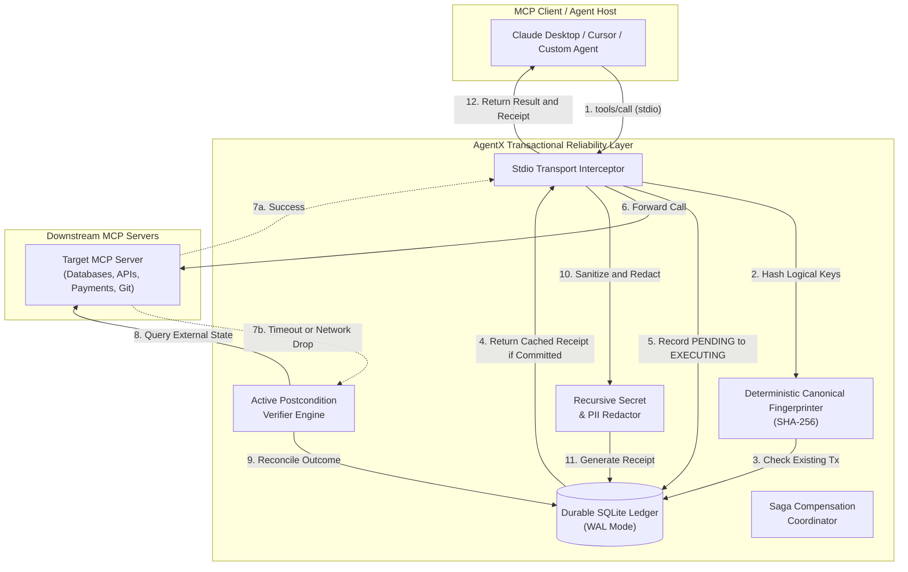
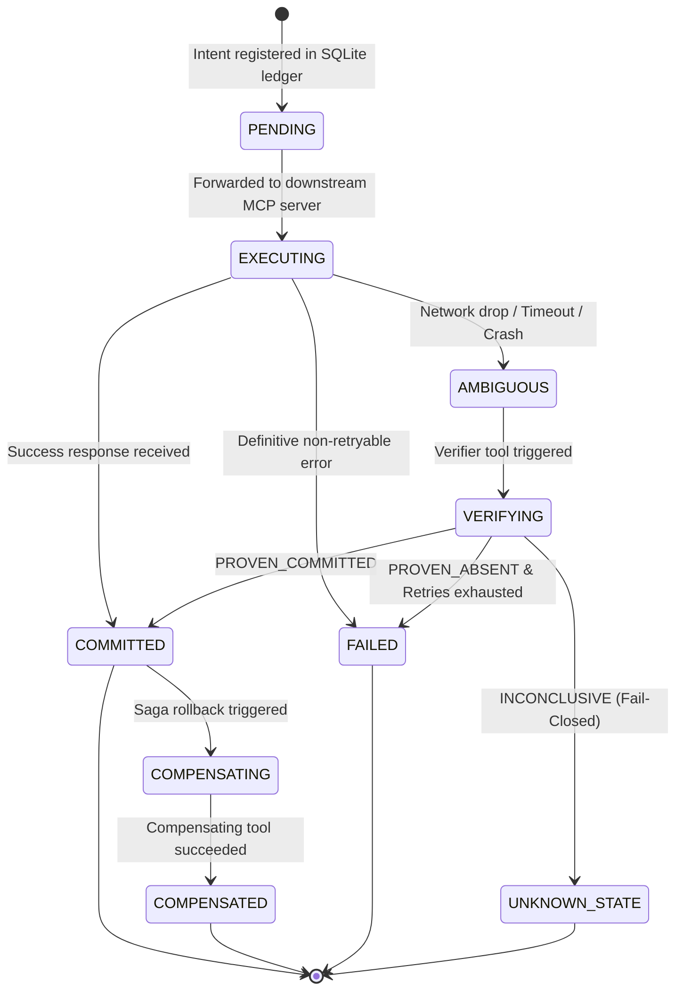

<div align="center">

  <a href="https://github.com/studivox/agentx">
    
  </a>

  <br/><br/>

  <p align="center">
    <a href="https://www.npmjs.com/package/@studivox/agentx"></a>
    <a href="https://github.com/studivox/agentx/actions/workflows/ci.yml"></a>
    <a href="LICENSE"></a>
    <a href="https://nodejs.org">= 20.0.0" /></a>
    <a href="https://www.typescriptlang.org/"></a>
    <a href="https://modelcontextprotocol.io"></a>
  </p>

  <p align="center">
    <strong>Preview, execute once, verify, and compensate AI agent actions across downstream MCP tools.</strong>
  </p>

  <p align="center">
    <a href="#quick-start"><b>Quick Start</b></a> •
    <a href="#why-agentx"><b>Why AgentX?</b></a> •
    <a href="#see-it-prevent-a-duplicate"><b>Interactive Demo</b></a> •
    <a href="#how-it-works"><b>How It Works</b></a> •
    <a href="#built-for-failure-not-happy-paths"><b>Architecture</b></a> •
    <a href="#safety-by-default"><b>Safety Model</b></a> •
    <a href="#cli-reference"><b>CLI Reference</b></a>
  </p>

</div>

<div align="center">

`35 tests passing` · `Node.js 20/22 CI green` · `4 reproducible demo scenarios` · `Local-first SQLite ledger`

</div>

<br/>

| ⚡ Execute Once | 🔍 Verify Reality | ↺ Compensate Safely |
| :--- | :--- | :--- |
| **Deterministic Identity & Replay Protection**<br/>Canonical JSON argument sorting and declared logical key hashing (`SHA-256`) prevent duplicate mutations with zero downstream calls. | **Active Postcondition Checks**<br/>Resolves ambiguous network drops and timeouts by interrogating external system state before making retry or fail-closed decisions. | **Declarative Saga Rollback**<br/>Automatically coordinates multi-step compensations in reverse (LIFO) order when composite operations experience unrecoverable failures. |

---

## Why AgentX?

When an AI agent executes real-world actions through the **Model Context Protocol (MCP)**—such as booking appointments, dispatching payments, creating GitHub pull requests, or updating databases—standard RPC network failures create dangerous ambiguity:

> **An action may succeed remotely while its network response is dropped or timed out. A blind retry will execute the mutating action a second time.**

```
[ Agent LLM ] ──( tools/call )──► [ Network Timeout / Drop ] ──( Blind Retry )──► [ Duplicate Side Effect! ]
                                         │
                                         ▼
                             (Action succeeded remotely,
                              but response was lost)
```

### Side-by-Side Comparison

| Failure Scenario | Without AgentX (Blind Retries) | With AgentX (Transactional Reliability) |
| :--- | :--- | :--- |
| **Network Timeout during Payment / Booking** | Agent assumes failure, retries action, causing **double charges or duplicate bookings**. | Intercepts timeout, executes declared **postcondition verifier**, proves remote commitment, and returns cached receipt. |
| **Agent Re-invokes Tool with Reordered JSON** | Formatting differences cause cache misses; downstream server executes duplicate mutation. | Deterministic **canonical sorting and logical key hashing** matches existing record, returning `idempotentReplay: true` with **0 downstream calls**. |
| **Flaky Unverified Destructive Mutation** | Blind retry risks catastrophic repeated destructive writes or corrupt state. | **Fail-Closed Safety**: Locks transaction into `UNKNOWN_STATE`, blocks blind retries, and emits actionable diagnostic alert. |
| **Failure in Multi-Step Workflow (Step 3 of 4 fails)** | Steps 1 and 2 remain orphaned and half-committed in downstream systems. | **Saga Coordinator** triggers registered compensators in reverse (LIFO) order to cleanly roll back prior steps. |
| **Credential / PII Logging in Audits** | Passwords, credit card numbers, or API keys are written to debug logs or disk. | Automatic **recursive parameter scrubbing** redacts sensitive keys matching policy rules before writing to ledger or receipt. |

---

## See It Prevent a Duplicate

<div align="center">
  
</div>

<details>
<summary><b>View Raw Terminal Verification Log</b></summary>

```text
============================================================
         AgentX Flagship Demonstration & Verification
============================================================

[AgentX] [INFO] Loaded AgentX manifest from examples/agentx.config.json
[Scenario 1] Executing First Mutating Request: book_appointment
  [Mock Server RPC] Executing tool: book_appointment (Call #1)
[AgentX] [INFO] Transaction tx_6f2846ab committed successfully.
  [+] Call 1 Completed.
  [+] Receipt ID: rcpt_87127ca2e828421ca5f6aa2babe53533
  [+] Transaction State: COMMITTED
  [+] Idempotent Replay: false
  [+] Sanitized Arguments stored in Ledger (PII Redacted):
      {"patientId":"patient_4081","doctorId":"doc_dr_ayse","date":"2026-09-01","slot":"14:30","patientPhone":"[REDACTED]","medicalNote":"[REDACTED]"}
  [+] Downstream Server RPC Invocations: 1

[Scenario 2] Agent attempts duplicate call with reordered arguments (Simulating blind retry)...
[AgentX] [INFO] Idempotent hit for book_appointment (Hash: 01c86a62c0...). Returning cached receipt.
  [✓] AgentX Intercepted Duplicate Call!
  [✓] Idempotent Replay Flag: true
  [✓] Server Call Count Delta: 0 (ZERO additional calls sent to downstream server!)
  [✓] Duplicate side-effect completely prevented.

[Scenario 3] Simulating Ambiguous Outcome (Timeout on booking, but state mutated in backend)...
  [Flaky Server RPC] Invoked: book_appointment
[AgentX] [WARN] Attempt 1 for tx_2432f6de failed with error: Connection reset by peer / ETIMEDOUT
[AgentX] [INFO] Starting postcondition verification for tx_2432f6de using verifier get_appointment
  [Flaky Server RPC] Invoked: get_appointment
[AgentX] [INFO] Postcondition verification completed: outcome=PROVEN_COMMITTED, state=COMMITTED
[AgentX] [INFO] Postcondition verification proved tx_2432f6de was already COMMITTED!
  [✓] AgentX Automatically Executed Postcondition Verifier: get_appointment
  [✓] Reconciled Final State: COMMITTED
  [✓] Verification Evidence:
      {"verifierArgs":{"patientId":"patient_9921","date":"2026-09-02"},"response":{"appointmentId":"appt_patient_9921_2026-09-02","status":"CONFIRMED"}}
  [✓] Ambiguity successfully resolved without duplicate execution!

[Scenario 4] Executing Saga Compensation for first appointment...
[AgentX] [INFO] Executing compensation for transaction tx_6f2846ab using tool cancel_appointment
  [Mock Server RPC] Executing tool: cancel_appointment (Call #4)
[AgentX] [INFO] Compensation finished: status=SUCCESS, finalState=COMPENSATED
  [✓] Compensation Status: SUCCESS
  [✓] Final Transaction State in Ledger: COMPENSATED
  [✓] Appointment Store Count: 2 (Appointment cancelled)

============================================================
        Demo Finished: All Transactional Invariants Verified!
============================================================
```
</details>

---

## Quick Start

### Global Installation via npm
```bash
# 1. Install AgentX CLI globally
npm install -g @studivox/agentx

# 2. Verify installation
agentx --help

# 3. Or run directly without installation via npx
npx @studivox/agentx --help
```

### Install in a Project
```bash
npm install @studivox/agentx
```

### Clone & Run from Source (Development)
```bash
# 1. Clone the repository
git clone https://github.com/studivox/agentx.git
cd agentx

# 2. Install dependencies & compile TypeScript
npm ci
npm run build

# 3. Verify all test suites and run the interactive demo
npm test
npm run demo

# 4. Run the AgentX system doctor
node dist/cli.js doctor --manifest examples/agentx.config.json
```

---

## How It Works

<div align="center">
  
</div>

AgentX sits transparently between any MCP client (Claude Desktop, Cursor, custom agents) and downstream MCP tool servers:

1. **Transparent Stdio Interceptor:** Captures `tools/call` JSON-RPC messages without altering downstream tool source code.
2. **Canonical Fingerprinting:** Deterministically sorts object keys recursively and extracts declared logical keys into a `SHA-256` digest.
3. **Durable SQLite WAL Ledger:** Records execution intent atomically (`PENDING` → `EXECUTING` → `COMMITTED` / `AMBIGUOUS` / `UNKNOWN_STATE`).
4. **Replay Short-Circuit:** Returns cached receipts immediately for existing `COMMITTED` transactions with **0 downstream invocations**.
5. **Active Postcondition Verification:** If network times out, runs declared inspection tools to verify backend state before deciding whether to retry or fail closed.
6. **Saga Compensation Coordinator:** Coordinates multi-step compensations in reverse (LIFO) order upon workflow failure.
7. **Recursive Secret Scrubbing:** Redacts sensitive credentials, tokens, and PII before writing to disk or receipts.

---

## Built for Failure, Not Happy Paths

### System Architecture



### Transaction State Machine Lifecycle



---

## Configuration Example

Declare operational reliability policies in `agentx.config.json`:

```json
{
  "version": "1.0.0",
  "serverName": "clinic-payment-service",
  "ledgerPath": ".agentx/agentx.db",
  "defaultPolicy": {
    "timeoutMs": 15000,
    "maxRetries": 2,
    "ttlSeconds": 604800
  },
  "tools": {
    "get_appointment": {
      "toolName": "get_appointment",
      "riskLevel": "READ_ONLY"
    },
    "book_appointment": {
      "toolName": "book_appointment",
      "riskLevel": "MUTATING_CRITICAL",
      "logicalKeys": ["patientId", "doctorId", "date", "slot"],
      "timeoutMs": 5000,
      "maxRetries": 2,
      "sensitiveFields": ["patientPhone", "medicalNote"],
      "verifier": {
        "toolName": "get_appointment",
        "argumentMapping": {
          "patientId": "patientId",
          "date": "date"
        },
        "matchKeyPath": "status",
        "expectedValue": "CONFIRMED"
      },
      "compensator": {
        "toolName": "cancel_appointment",
        "argumentMapping": {
          "appointmentId": "result.appointmentId"
        }
      }
    },
    "cancel_appointment": {
      "toolName": "cancel_appointment",
      "riskLevel": "MUTATING_SAFE",
      "logicalKeys": ["appointmentId"]
    }
  }
}
```

---

## Integration Guide

### Wrap an MCP Server via CLI
Wrap any existing MCP server command with zero changes to downstream code:

```bash
# Using global npx
npx @studivox/agentx wrap --server "node" "/path/to/my-mcp-server.js" --manifest "agentx.config.json"

# Or using locally installed agentx binary
agentx wrap --server "node" "/path/to/my-mcp-server.js" --manifest "agentx.config.json"
```

### Configure in Claude Desktop or Cursor
In your `claude_desktop_config.json` or `mcp_config.json`:

```json
{
  "mcpServers": {
    "booking-service": {
      "command": "npx",
      "args": [
        "-y",
        "@studivox/agentx",
        "wrap",
        "--server",
        "node",
        "/path/to/booking-server.js",
        "--manifest",
        "/path/to/agentx.config.json"
      ]
    }
  }
}
```

---

## CLI Reference

AgentX provides a complete CLI for operators and developers:

```bash
# 1. Start the transparent transactional proxy
agentx wrap --server "node" "dist/server.js" --manifest "agentx.config.json"

# 2. List recent ledger transactions
agentx list --state COMMITTED --limit 10

# Output as structured JSON
agentx list --json

# 3. Inspect detailed attempt history and state transitions
agentx status tx_2432f6de1f904180afaecc2c4a2a9d8b

# 4. Export evidence-backed receipt JSON
agentx receipt tx_2432f6de1f904180afaecc2c4a2a9d8b

# 5. Run database health and configuration integrity doctor
agentx doctor --manifest agentx.config.json
```

### Environment Variables

| Variable | Description | Default |
| :--- | :--- | :--- |
| `AGENTX_DB_PATH` | Path to durable SQLite ledger database | `.agentx/agentx.db` |
| `AGENTX_CONFIG` | Path to policy manifest configuration file | `agentx.config.json` |
| `AGENTX_LOG_LEVEL` | Diagnostic log level (`DEBUG`, `INFO`, `WARN`, `ERROR`, `SILENT`) | `INFO` |

---

## Evidence-Backed Receipt Format

Every transactional mutation yields an auditable JSON receipt stored in the ledger with deterministic SHA-256 fingerprinting:

```json
{
  "receiptId": "rcpt_ea07175f9a844ed9943ab1a57ce575a5",
  "transactionId": "tx_2432f6de1f904180afaecc2c4a2a9d8b",
  "fingerprint": "fc67aab5c3fb8a0a49cf0806b5ae4970aebe18dcb50c38d167045174756a705a",
  "toolName": "book_appointment",
  "state": "COMMITTED",
  "riskLevel": "MUTATING_CRITICAL",
  "idempotentReplay": false,
  "createdAt": "2026-08-24T18:46:36.507Z",
  "committedAt": "2026-08-24T18:46:36.512Z",
  "sanitizedArguments": {
    "patientId": "patient_9921",
    "doctorId": "doc_dr_mehmet",
    "date": "2026-09-02",
    "slot": "10:00"
  },
  "result": {
    "appointmentId": "appt_patient_9921_2026-09-02",
    "status": "CONFIRMED"
  },
  "attemptsCount": 1,
  "verificationEvidence": {
    "verifierArgs": {
      "patientId": "patient_9921",
      "date": "2026-09-02"
    },
    "response": {
      "appointmentId": "appt_patient_9921_2026-09-02",
      "status": "CONFIRMED"
    }
  }
}
```

---

## Safety by Default

* **Fail-Closed Ambiguity Guard:** If a critical mutation times out and no verifier is declared (or the verification check is inconclusive), AgentX locks the transaction into `UNKNOWN_STATE` and halts blind retries to prevent duplicate mutations.
* **Automatic Secret Redaction:** Scrubbing engine automatically replaces declared sensitive fields, API keys, passwords, and tokens with `[REDACTED]` prior to ledger writes.
* **ACID Local Isolation:** SQLite Write-Ahead Logging (`WAL`) mode provides transactional durability without external network roundtrips.

---

## What AgentX Does Not Promise

AgentX is engineered for practical, rigorous operational reliability:
1. **Not Universal Distributed 2PC:** Third-party web APIs that lack query/verifier endpoints or idempotency keys cannot be made 100% atomic if they fail ambiguously. AgentX protects against duplicate execution by failing closed (`UNKNOWN_STATE`).
2. **Requires Verifier Declarations for Complex APIs:** To prove state after a dropped connection, an inspection tool (e.g., `get_payment_status`, `check_ticket`) should be declared in the manifest.
3. **Local-First Disk Requirement:** The SQLite WAL ledger requires access to local persistent storage.

---

## Roadmap

- [x] **v0.1.0:** Initial public preview release on npm (`@studivox/agentx`). Deterministic fingerprinting, SQLite WAL ledger, active verifier engine, saga coordinator, stdio proxy, CLI, secret redactor.
- [ ] **v0.2.0:** Remote Streamable HTTP / SSE transport proxy support.
- [ ] **v0.3.0:** Auto-synthesizing verifier schemas directly from OpenAPI / MCP schema metadata.
- [ ] **v0.4.0:** Local web-based interactive visual ledger explorer.

---

## Community & Contributing

We welcome contributions to expand the transactional reliability frontier for AI agents!

* **Contributing Guide:** See [CONTRIBUTING.md](CONTRIBUTING.md) for development setup and guidelines.
* **Security Disclosures:** See [SECURITY.md](SECURITY.md) for vulnerability reporting.
* **Code of Conduct:** See [CODE_OF_CONDUCT.md](CODE_OF_CONDUCT.md).
* **Changelog:** See [CHANGELOG.md](CHANGELOG.md).

---

## License

[MIT License](LICENSE). Copyright (c) 2026 AgentX Core Maintainers.
